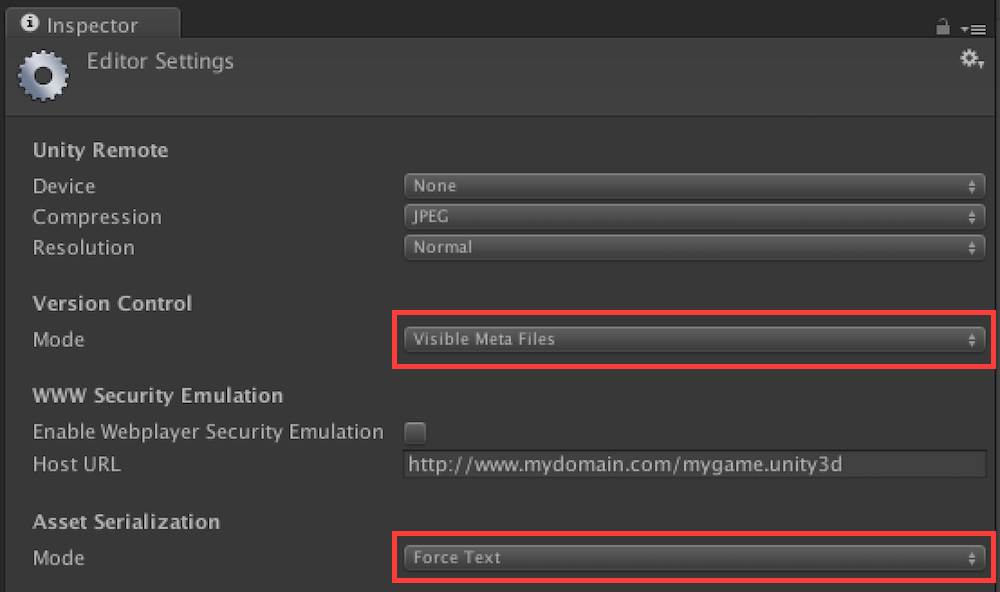

# Unity Base

This is a grab-bag of attributes, extensions, utilities, etc... that can help you jumpstart your Unity projects and prototypes. I use them for my own Unity projects, so you can expect this to be maintained as long as I use Unity.

It includes:

- Generators for `.gitignore` and `.sublime-project` files.
- Generators to automatically create typed constants for your `Levels`, `Tags`, `Layers`, and `AnimatorControllerParameter`s
- Math helpers such as `LinMap`, which makes it easy to scale values from one range to another.
- Attributes and associated `PropertyDrawer`s such as `[CurveRange]`, which allow you to specify limits for your `AnimationCurve`s.
- And more!

## Initial Setup (Important!)

If you want to use Unity with `git`, you'll need to change your initial project settings as follows:

`Edit -> Project Settings -> Editor`


### Asset Serialization: Force Text
`Force Text` ensures that Unity's assets (prefabs, scene files, etc...) are stored as plain text instead of binary, which is the default. Doing this makes it possible for `git` to merge changes from multiple contributors. It should also reduce the eventual size of your repository, because `git` stores changes to files as deltas, and binary deltas generally can't be compressed very well.

When `Force Text` is active, Unity saves your assets as YAML, which is ["a human friendly data serialization standard for all programming languages."](http://yaml.org/). YAML is similar to [JSON](http://www.json.org/) but relies on indentation instead of block symbols.

### Mode: Visible Meta Files
Unity identifies objects using identifiers called [guids](https://en.wikipedia.org/wiki/Globally_unique_identifier). It uses these identifiers for lots of things, including keeping track of which prefabs are part of each scene and what components are attached to which game objects. Unity stores these guids in `.meta` files, so it's essential that you keep these files versioned along with your code.

*Don't forget: use `File -> Save Project` to save these settings*


## Usage

Choose parts of the `UnityBase/Assets/Scripts/` folder to drag into your own `Assets/Scripts/` folder. Read on to determine which components depend on each other.

### Code Generators (`Scripts/CodeGenerators/Editor`)

Each of the following Generators depends on `Scripts/CodeGenerators/Editor/Base`.
It provides `ConstantsGenerator.ConstantsWriter`, which makes it easy to create your own code generators. Look at `Scripts/CodeGenerators/Editor/SublimeProjectGenerator.cs` for a simple usage example.

#### GitignoreGenerator (generates `.gitignore` file)
Adding this to your project will add `Edit -> Generate Gitignore File` to the Unity menu, which will create a Unity-specific `.gitignore` file outside of your Unity project folder. The generated file will tell `git` to ignore the Unity/OS files that shouldn't be version controlled (for example, Unity's `Temp` and `Library` folders).

Here's how your directory structure should look:

```
MyGitProject/
   .git
   .gitignore <-- generated by this generator
   MyUnityProject/
      Assets/
      ... (other files)
   ... (other files)
```

#### SublimeProjectGenerator (generates `*.sublime-project` file for OmniSharp autocomplete goodness)
This is useful if you use [Sublime Text 3](https://www.sublimetext.com/3) to edit your code.
It assumes that you have the [OminSharp](https://github.com/OmniSharp/omnisharp-sublime) plugin installed in Sublime. Putting this generator in your project will add `Edit -> Generate Sublime Project File` to the Unity menu, which will create an OmniSharp-specific `*.sublime-project` file outside of your Unity project folder.

Here's how your directory structure should look:

```
MyGitProject/
   .git
   MyUnityProject.sublime-project <-- generated by this generator
   MyUnityProject/
      Assets/
      ... (other files)
   ... (other files)
```

#### UnityAnimationConstantsGenerator
Unity internally refers to Animator entities by `int` hash codes, but its API for getting them makes animation code verbose and brittle. Putting this generator in your project will add `Edit -> Generate UnityAnimationConstants.cs` to the Unity Menu, which will prompt you for a save location and then create `UnityAnimationConstants.cs` there. The file will contain a unique namespace for each `*.controller` file in your project, with an associated `Parameters` static class. You can then do the following:

```
using UnityAnimationConstants.MyController;

// ...
void SomeMethod() {
	animator.SetFloat(Parameters.AFloatParam, 1f); // Parameters.AFloatParam is an auto-generated int
}
//...

```

You'll need to use the menu item again if you change your animator controller parameters.

#### UnityConstantsGenerator
Unity's API for layers, scenes, and tags rely on strings and ints. If you mistype a string or change a number, you'll get an error at runtime. Putting this generator in your project will add `Edit -> Generate UnityConstants.cs` to the Unity Menu, which will prompt you for a save location and then create `UnityConstants.cs` there. The file will contain a `UnityConstants` namespace with static classes containing constants for your tags, levels, and layers.

You'll need to use the menu item again if you change your tags, levels, or layers.

### MathHelpers (`Scripts/CodeHelpers`)
**NOTE: I'm considering making `MathHelpers` extension methods of `Mathf` or creating partials so that you can pick which functions to include by adding one file per set of related functions**

`MathHelpers.cs` is a static class that provides common math functions Unity doesn't include by default. These include:


#### LinMap
These functions make it easy to linearly map an input range to an output range. This is especially useful for animation code.

#### Mod(int n, int m)
Modulus that makes negative n positive if m is positive. This is useful for indexing into arrays with negative numbers.

```
Mod(-1, anArray.Length) == anArray.Length-1
Mod(anArray.Length, anArray.Length) == 0
```

### Attributes (`Scripts/Attributes`)
Each Attribute comes in a self-contained folder including an attribute and a corresponding `PropertyDrawer`.

#### CurveRange
This attribute allows you to specify limits for your `AnimationCurve`s so that you can't accidentally make them extend beyond the desired limits in the inspector. For example:

```
// An animation curve that ranges from 0..1 (inclusive) on both axes. I use this for most of my curves.
[CurveRange, SerializeField] AnimationCurve _my01Curve;

// An animation curve that ranges from 0..1 (inclusive) on the x axis and 0..5 on the y axis
[CurveRange(0,1,0,5), SerializeField] AnimationCurve _my0105Curve;
```

**TODO: Describe the other attributes**


### Extensions (`Scripts/Extensions`)

#### InterfaceExtensions
These will allow you to use interfaces to write swappable components, leading to reusability and reduced coupling. Note that methods like `GetComponent<>` and `GetInterface<>` allocate memory on the heap, so try to cache the results where possible. You don't want GC spikes!

```
// Gets a component from aGameObject that implements MyInterface
MyInterface aGameObjectsMyInterface = aGameObject.GetInterface<MyInterface>();
```

### Geometry (`Scripts/Geometry`)
These depend on `Geometry/Base`, which provides `ISegmentsProvider`.

#### TubeRenderer
Depends on `Scripts/CodeHelpers/MathHelpers` for `Mod`.

Implement `ISegmentsProvider` on a component that provides a set of 3d segment positions and tangents. You can then use `TubeRenderer` to extrude a tube mesh with desired resolution along the provider. `TubeRenderer` computes the parallel transport frame as described [here](https://www.cs.indiana.edu/ftp/techreports/TR425.pdf), which makes it robust to kinks and artifacts you might otherwise see with a naive extrusion implementation.

#### HermiteSpline
Implements `ISegmentsProvider`. Use it as the basis for curved paths or in conjunction with `TubeRenderer`.


## License

Unless otherwise indicated in the source files, all assets are provided under the terms of the MIT open source license.


